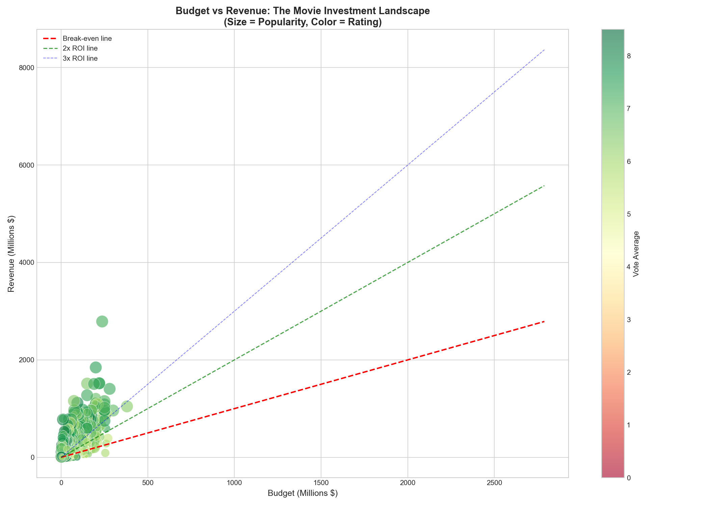
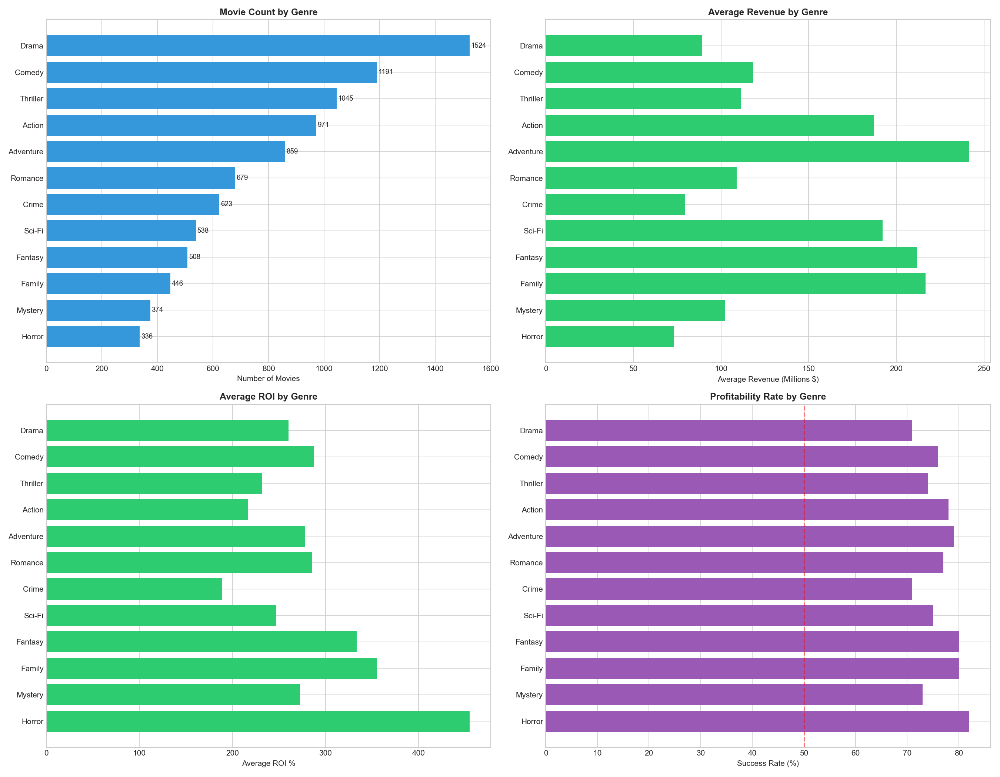
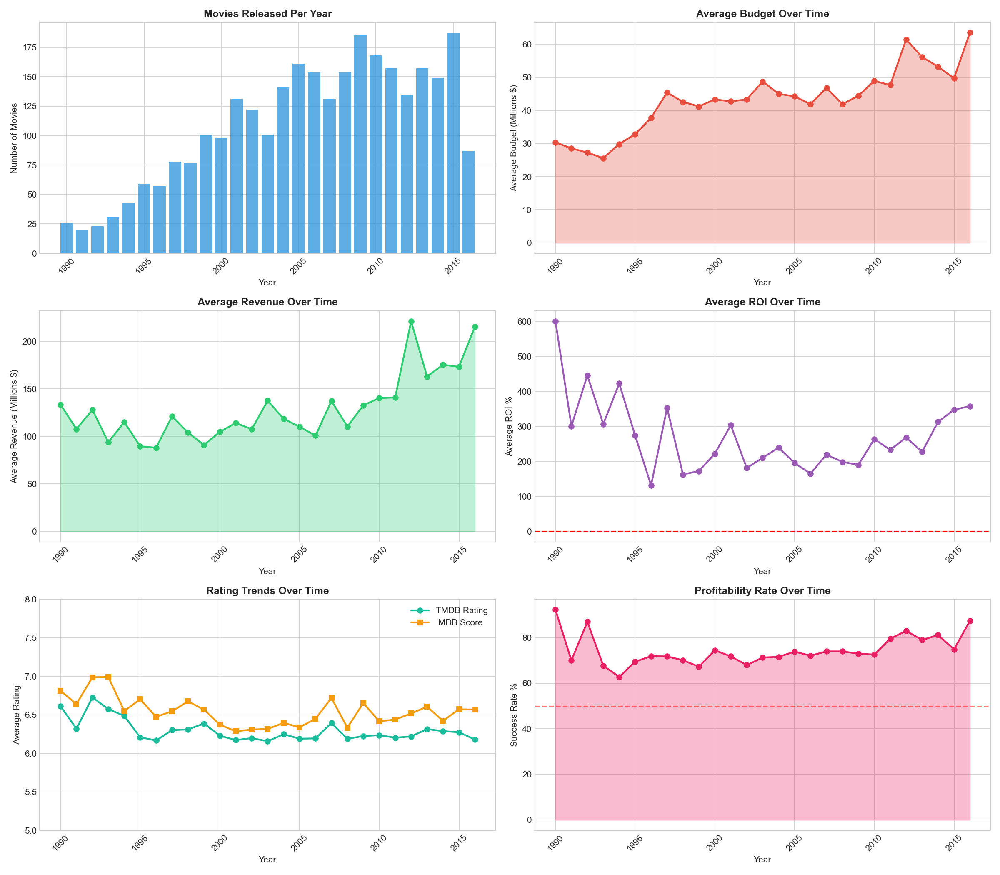
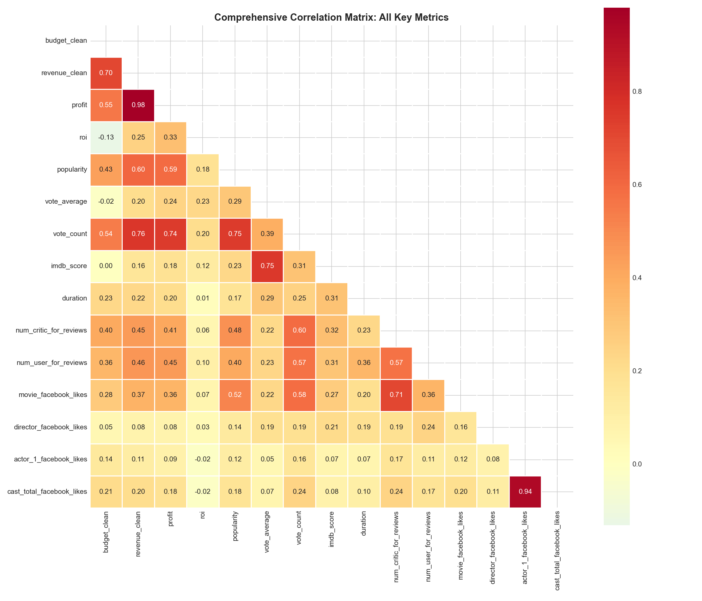
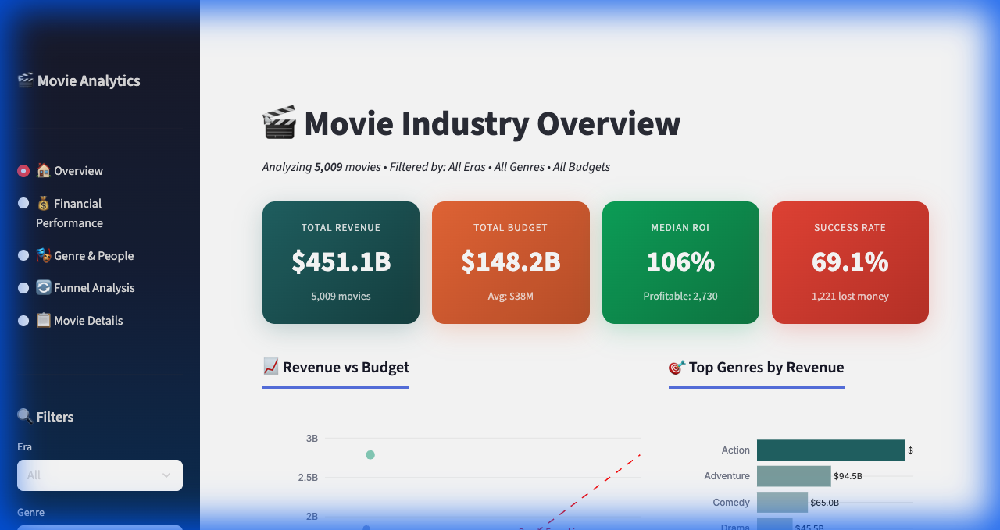

# 🎬 Movie Industry Profitability Analysis

  

> A portfolio project demonstrating end-to-end business analysis - from understanding the industry's economics, to cleaning messy data, to delivering insights that could change how a studio allocates capital.

**Built for:** Studio executives evaluating capital allocation, film investors assessing risk, and data professionals studying industry-level profitability patterns.

---

## Table of Contents

- [The Business Problem](#the-business-problem)
- [Understanding the Business Model](#understanding-the-business-model)
- [The Data](#the-data)
- [What the Analysis Revealed](#what-the-analysis-revealed)
- [Business Recommendations](#business-recommendations)
- [Visual Preview](#visual-preview)
- [Dashboards](#dashboards)
- [Skills Demonstrated](#skills-demonstrated)
- [Limitations & Assumptions](#limitations--assumptions)
- [Lessons Learned](#lessons-learned)
- [Future Improvements](#future-improvements)

---

## The Business Problem

The film industry operates on a model most investors would reject: **nearly half of all products fail**. Studios spend $35M on average to produce a single film, with no guarantee it will recover its investment. Unlike most industries, there's no prototype, no beta test, no soft launch - a movie either lands or it doesn't.

This creates a critical business question that studios, distributors, and investors face every quarter:

> **Where does money get lost in the moviemaking pipeline, and what levers actually reduce that risk?**

This project analyzes **5,009 movies** across five decades (1970-2017) to answer that question with data.

---

## Understanding the Business Model

Before touching the data, I mapped the economics:

```
Studio invests $X (production budget)
    → Film is produced
    → Marketing spend adds 50-100% on top (not in this dataset)
    → Distributed to theaters (theaters keep ~50% of ticket sales)
    → Earns box office revenue
        → Revenue > Budget? → Profit on paper
        → Revenue < Budget? → Loss
```

> **Important caveat:** The budget figures in this dataset cover *production costs only*. Real break-even requires ~2-2.5x the production budget when marketing and distribution are included. This analysis works with what the data provides, but acknowledges this gap.

The challenge: **the relationship between investment and return is not linear**. A $200M movie doesn't earn 2x what a $100M movie earns. Some $5M horror films return 4000%, while $250M blockbusters lose everything. The data needed to explain *why*.

---

## The Data

| Source | Rows | What It Contains |
|--------|------|-----------------|
| **TMDB** | 4,803 | Budget, revenue, genres, ratings, popularity, release dates |
| **IMDB Metadata** | 5,043 | Directors, actors, Facebook likes, content ratings |
| **Merged Master** | 5,009 | 42 columns - financial, creative, social, and temporal features |

**Data Quality Issues Found:**
- Budget missing for 10% of films; revenue missing for 13%
- Genre data stored as raw JSON strings - required parsing
- Social media metrics had nulls that needed logical imputation
- Character encoding issues in movie titles

All resolved through the ETL pipeline ([full detail](docs/methodology.md)).

---

## What the Analysis Revealed

### 1. The Industry Is a Coin Flip

**54.5% of movies are profitable.** That means for every two films a studio releases, one loses money. This isn't a surprise to insiders - but the data quantifies *how much* is lost and *where*.

**Business Impact:** Studios should think in portfolio terms, not individual bets. Diversifying across budget tiers and genres reduces aggregate risk.

---

### 2. Bigger Budgets != Better Returns

| Budget Tier | Count | Success Rate | Median ROI | Risk Profile |
|-------------|-------|-------------|------------|------|
| Low (<$15M) | 1,277 | 71.7% | High variance | Rare hit = extraordinary ROI. Most fail quietly |
| **Mid ($15M-$40M)** | **1,319** | **68.5%** | **86.5%** | **Best risk-adjusted - consistent, limited downside** |
| High ($40M-$100M) | 988 | 72.9% | Moderate | Solid performers, but capital-intensive |
| Mega ($100M+) | 310 | 90.6% | Lower | Highest success rate - but when they fail, losses are catastrophic |

**Budget ↔ Revenue correlation: 0.73** - spending more *correlates* with higher revenue, but the ROI tells the opposite story. The marginal return on each additional dollar of budget decreases.

**Business Impact:** Blockbusters have the highest success rate (90.6%), but they require $100M+ per bet - a single failure wipes out multiple wins. Mid-budget films ($15M-$40M) offer the **most consistent returns at manageable risk**.

---

### 3. Genre Is a Risk Lever, Not Just a Creative Choice

| Genre | Avg ROI | Why |
|-------|---------|-----|
| **Horror / Mystery** | Highest | Audiences show up regardless of budget - no need for $100M in VFX |
| **Animation / Family** | High | Built-in audience (kids + parents), merchandise revenue extends value |
| **Comedy** | Moderate | Consistent but rarely spectacular - the "steady earner" |
| **Action / Adventure** | Moderate | High total revenue, but requires massive budgets - high downside risk |
| **Drama** | Lowest | Most oversaturated genre - too many films chasing the same audience |

**Business Impact:** Genre selection is an *investment decision*, not just a creative one. A portfolio weighted toward Horror and Animation has a structurally higher expected return than one weighted toward Drama and Sci-Fi.

---

### 4. The Funnel Shows Where Money Dies

I modeled the movie lifecycle as an **Investment-to-Profitability funnel** - the same methodology used in sales pipeline analysis - to identify exactly where conversion drops:

```
Stage                              Count    % of Total    Drop
-----------------------------------------------------------------
Total Movies                       5,009     100.0%
Has Budget Data                    3,951      78.9%      -21.1%
Generated Revenue                  3,767      75.2%       -3.7%
Recovered 50%+ of Budget           3,191      63.7%      -11.5%  ← Biggest leak
Profitable (Revenue > Budget)      2,732      54.5%       -9.2%
Strong ROI (>100%)                 2,019      40.3%      -14.2%
Exceptional ROI (>300%)            1,425      28.4%      -11.9%
```

**The #1 bottleneck:** The 11.5% drop between "Generated Revenue" and "Recovered 50%+" - 576 movies earned *something* at the box office but couldn't recover even half their budget. This is where the most capital is destroyed industry-wide.

**Business Impact:** The highest-leverage intervention isn't making better movies - it's tighter cost control at the production stage. If you can lower the break-even threshold by 20%, you convert hundreds of "almost profitable" films into profitable ones.

---

### 5. People Reduce Risk

- **Christopher Nolan, Steven Spielberg, James Cameron** consistently outperform industry averages on both revenue *and* ROI - a proven director functions as a risk-mitigation asset
- **Vote Count ↔ Revenue: r = 0.78** - the strongest predictor of box office performance is audience engagement, not budget or critical ratings
- **PG-13** films hit the broadest demographic - they're the financial sweet spot for audience reach

**Business Impact:** Talent attachment isn't just a creative decision - it's a risk hedge. Studios should model director/actor track records as an input to greenlight decisions.

---

## Business Recommendations

Based on the analysis, here's what a studio's capital allocation strategy should look like:

| Recommendation | Rationale |
|----------------|-----------|
| **Weight portfolio toward $15M-$40M productions** | Best risk-adjusted ROI; limits catastrophic downside |
| **Allocate capital to Horror/Mystery** | Highest capital efficiency - low cost, high conversion |
| **Attach proven directors to high-budget bets** | Measurably reduces failure probability on $100M+ films |
| **Default to PG-13 unless genre demands otherwise** | Maximizes addressable audience |
| **Implement break-even threshold analysis pre-greenlight** | The #1 funnel leak is "earned revenue but not enough" - tighter upfront modeling prevents this |

### Quantified Impact

If a studio had weighted its portfolio toward **Horror and Mystery** titles:
- Success rate would have been **84.6-85.7%** - vs the industry's **72.5%** overall
- That's a **12+ percentage point improvement** in capital efficiency
- On a 100-film portfolio, that's **12 fewer losses** per cycle

This isn't a theoretical model - these are the actual success rates from 5,009 movies in the dataset.

---

## Visual Preview

| Budget vs Revenue Landscape | Genre Performance |
|:--:|:--:|
|  |  |

| Industry Trends (1970-2017) | Correlation Matrix |
|:--:|:--:|
|  |  |

> 16 total visualizations available in [`outputs/`](outputs/)

---

## Dashboards

### Streamlit (Local - 5 Pages)
Overview KPIs · Financial Performance · Genre & People Analysis · Funnel Visualization · Movie Browser



```bash
streamlit run app.py
```

> Dependencies are listed in `requirements.txt`. If running for the first time: `pip install -r requirements.txt`

---

## Skills Demonstrated

| Skill | Application |
|-------|------------|
| **Business Understanding** | Mapped the studio P&L model before touching data |
| **EDA** | Distributions, correlations, outlier detection, missing data profiling |
| **ETL / Data Engineering** | JSON parsing, multi-source merge, feature engineering, categorical binning |
| **Business Frameworks** | Investment-to-Profitability funnel modeled after sales pipeline methodology |
| **Data Visualization** | Matplotlib/Seaborn (static), Plotly/Streamlit (interactive) |
| **Analytical Communication** | Translated data patterns into capital allocation recommendations |

---

## Project Structure

```
Movies Dataset/
├-- data/                           # Raw datasets (TMDB + IMDB)
├-- notebooks/
│   ├-- 01_exploratory_data_analysis.py   # EDA - 16 charts
│   ├-- 02_etl_tableau_prep.py            # ETL → 6 clean CSVs
│   └-- 03_funnel_analysis.py             # 8-stage funnel
├-- outputs/
│   ├-- tableau/                    # Tableau-ready datasets
│   └-- *.png                       # Visualization charts
├-- docs/
│   └-- methodology.md              # Full technical detail
├-- app.py                          # Streamlit dashboard
└-- requirements.txt
```

## Tech Stack

| Tool | Purpose |
|------|---------|
| **Python** (Pandas, NumPy) | Data analysis |
| **Matplotlib / Seaborn** | Static visualizations |
| **Streamlit / Plotly** | Interactive dashboard |

## Data Sources

- [TMDB 5000 Movies](https://www.kaggle.com/datasets/tmdb/tmdb-movie-metadata) - Budget, revenue, genres, ratings
- **IMDB Movie Metadata** - Directors, actors, social media metrics

For full technical methodology, see [**docs/methodology.md**](docs/methodology.md).

---

## Limitations & Assumptions

| Limitation | Impact on Analysis |
|------------|-------------------|
| **Production budget only** | Marketing costs (often 50-100% of budget) are excluded - true break-even is higher than calculated |
| **Theatrical revenue only** | No streaming, home video, or merchandise data - total film value is underestimated |
| **Data ends at 2017** | Doesn't capture the streaming revolution (Netflix originals, Disney+, etc.) |
| **Survivorship bias** | Dataset skews toward films with available data - truly obscure releases may be underrepresented |
| **No inflation adjustment** | A $100M budget in 1995 != $100M in 2015 - comparisons across decades are approximate |

These constraints are noted throughout the analysis. The findings remain directionally valid for understanding industry patterns, but absolute dollar figures should be interpreted with caution.

---

## Lessons Learned

**On the data:** The messiest part wasn't missing values - it was the JSON-encoded columns (genres, production companies, keywords). Parsing these required writing custom extraction functions and deciding how to handle multi-genre films (explode into rows vs. take primary genre). Both approaches were implemented for different use cases.

**On the analysis:** The median tells a completely different story than the mean in this dataset. Average ROI is distorted by extreme outliers (Paranormal Activity: $15K budget → $194M revenue). I learned to always present both, and to explain *why* the numbers diverge - that's the analyst's job, not just reporting the metric.

**On business framing:** The funnel was the most valuable output - not because the numbers were surprising, but because it gave stakeholders a *framework* to think about movie investment. Presenting data as "54.5% are profitable" is a fact. Presenting it as "here's where the other 45.5% fall out of the funnel, and here's the specific stage where intervention has the highest leverage" - that's analysis.

**What I'd do with more data:** Marketing spend would be the single highest-value addition. If I could layer in P&A (prints and advertising) budgets, the true break-even calculation would shift dramatically - and I suspect the "mid-budget sweet spot" finding would become even more pronounced, since blockbusters have proportionally larger marketing costs.

---

## Future Improvements

- [ ] Predictive model to forecast profitability pre-release
- [ ] Streaming revenue data (Netflix, Disney+) for modern market analysis
- [ ] Marketing spend (P&A) analysis when data becomes available
- [ ] Inflation-adjusted budget/revenue comparisons
- [ ] Tableau Public dashboard for shareable BI views

---

## Author

**David Ezieshi** - Business Analyst & Data Analytics  
[LinkedIn](https://www.linkedin.com/in/david-ezieshi/) · [GitHub](https://github.com/ezieshie-stack)
